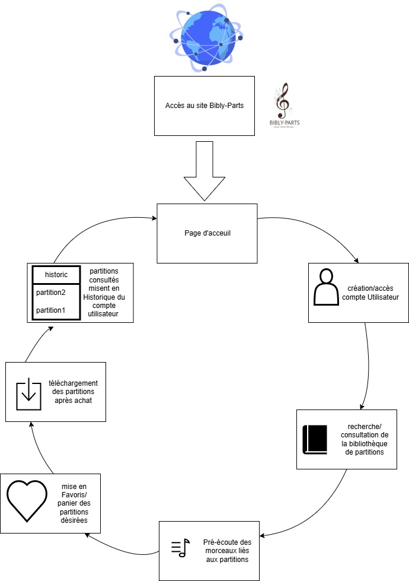
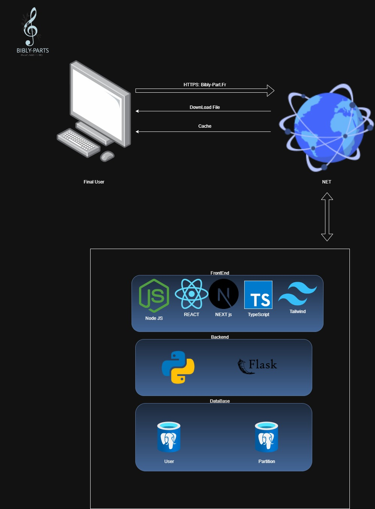

# Bibly-Parts 🎶

**Bibly-Parts** est un site web dédié à la vente, au partage et à la gestion de **partitions musicales**.
Ce projet combine un frontend moderne en **Next.js / TypeScript / Tailwind CSS** avec un backend en **Flask / SQLAlchemy**, le tout structuré autour d’une architecture claire et évolutive.

---

## 🎯 Objectifs du projet

- Proposer un **catalogue de partitions musicales** avec recherche par style, instrument, auteur ou titre.
- Permettre la **prévisualisation des partitions** (PDF) et la **pré-écoute** (audio).
- Offrir une **gestion complète des utilisateurs** : inscription, connexion, modification des données, suppression du compte.
- Gérer un **panier d’achat** et une **liste de favoris**.
- Fournir un design soigné évoquant les partitions anciennes (teintes crème / sépia).

---

## ⚙️ Architecture du projet

### 🌐 Frontend
- **Next.js / React / TypeScript**
- **Tailwind CSS** pour le design responsive et accessible
- **Gestion des états :** hooks React + contextes

### 🔗 Backend
- **Flask**
- **SQLAlchemy** (base SQLite en dev, extensible PostgreSQL si besoin)
- **JWT pour l’authentification**
- **Cloudinary** pour le stockage des médias

---

## 📌 Diagrammes du projet

### 📝 Diagramme Life_cycle



---

### 🏗 Diagramme d’architecture technique



Les diagrammes détaillés (modèles, séquence) figurent dans les **annexes** du cahier des charges.

---

## 🗂 Structure du projet

````bash
/backend
/models → Modèles SQLAlchemy (User, Partition, Panier, etc.)
/routes → Routes Flask
run.py → Serveur Flask
/frontend
/app → Pages et composants Next.js
/public → Images publiques
/tests
test_*.py → Tests unitaires du backend
/docs
uml_global.png → Diagramme UML
architecture_framework.png → Schéma d’architecture
````

---

## 🚀 Lancement du projet en local (résumé)

### Backend
````bash
cd backend
python3 -m venv venv
source venv/bin/activate
pip install -r requirements.txt
python run.py
````

### Frontend

````bash
`cd frontend
npm install
npm run dev`
````

➡️ Frontend : [http://localhost:3000](http://localhost:3000)
➡️ Backend : [http://127.0.0.1:5000](http://127.0.0.1:5000)


### Tests unitaires
````
`python -m unittest discover tests`
````


✅ Les tests couvrent la gestion des utilisateurs, des partitions et des paniers.

----------

## 🛠 Choix techniques majeurs

-   **Frontend :** Next.js (App Router), TypeScript, Tailwind CSS

-   **Backend :** Flask + SQLAlchemy

-   **Stockage médias :** Cloudinary

-   **Authentification :** JWT

-   **Base en développement :** SQLite


----------

## 📚 Ressources annexes

-   Diagrammes UML détaillés (voir `docs/uml_détails/`)

-   Cahier des charges complet

-   Plan de tests


----------

## 🤝 Réalisé par Gaël Deschamps

Projet réalisé dans le cadre d’une certification **RNCP Niveau 6**.

#### Holberton School Laval  - #C21 (2023-2025)
